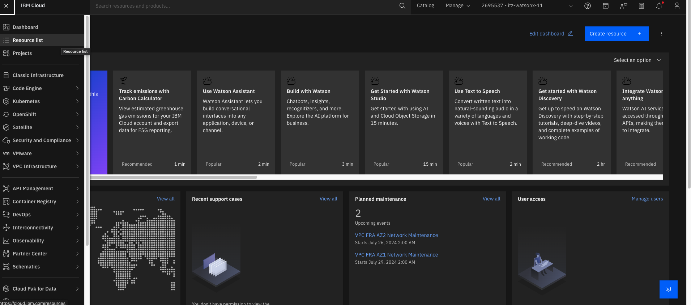

<u>**Lab 101** (**Setup project and spaces**</u>)

1. **<u>Accessing watonx.governance</u>**

1.1. Go to your ibm cloud account (click on the invite you received)

1.2. When inside your cloud account, click on the hamburger tile on top left, and select Resource List

1.3. Under Resource list, click on the name section corresponding to the watsonx.governance product:

1.4. In the next screen, click on launch watsonx.governance:

2. **<u>Create new project</u>**

Before we proceed with model development and deployment, we will create a new project, which will store all the necessary assets that will be developed (such as trained model, training pipeline, training notebooks, etc.)

2.1. Click on the hamburger menu on the top-left, and select view all projects, the following pop-up will show and will contain no project. Select New Project, and fill all the details as shown below and click Create.

2.2. After creating the project, you need to associate your project to a watsonx machine learning instance. Within your project, go to Services & Integration under the manage tab, and click on associate service:

2.3. Select the itzml instance, and click on associate.

2.4. Now our project is ready to train and deploy the ML model.

We will continue from here in the next lab.
