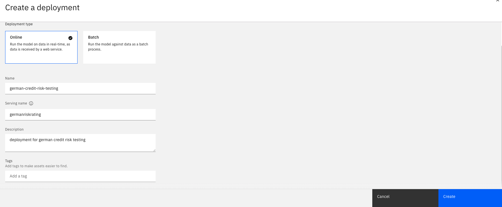

**<u>Lab 102</u>** (**<u>Model development and deployment</u>**)

1.  **<u>Model Development</u>**

In this section, we will develop a simple classification model using watonx Auto AI and then deploy it.

    1.  Go to the project created in the previous lab.

    2.  Once within the project, click on assets, and select new asset.

    3.  In the pop-up screen, scroll down to Work with models section, and select build machine learning models automatically.

    4.  In the next screen, populate details of your model pipeline (sample shown below), and click create.

    5.  In the next screen, upload the training data that has been provided to you by clicking browse, and selecting the file from your local system.

    6.  In the next screen, select whether it’s a time series forecasting model or not (for our use case, since it’s a classification, we select No), and then select the target variable (from the drop down) which we want to predict (Risk)

    7.  After doing the selections in the previous step, you will get 2 options – experiment settings and run experiment. For this lab, lets run the experiment on default setting. Click on Run Experiment:

    8.  In the next screen, after few minutes, the experiment starts running, and you can see the different pipelines on the leaderboard. Once the experiment finishes, you can see the details of the top performing pipeline.

    9.  On the top right, you will see when the experiment finishes – post that click on the top performing pipeline to open the pipeline details. You can view all the details related to the pipeline, such as model details, feature summary and evaluation metrics. Once satisfied, click on save as to save the model:

    10. In the next screen, select Model (under asset type), and provide any name of your choice (or retain the default name). Click on create.

You successfully saved your model, and now we can move to next section where we will deploy this model.

2.  **<u>Promote model to the deployment space</u>**

Next, you will promote the model to a deployment space and deploy it. Watsonx uses deployment spaces to organize models and model-related assets for validation and production access. Deploying the model allows it to be accessed via REST API for further testing.

    1.  Return to the browser tab showing the model in the project. You can do this by navigating back to your project list. Click on the model from the Assets tab.

    2.  Click the rocket ship icon to promote the model to a deployment space. The Promote to space screen opens.

    3.  In the promote to space screen, create a new deployment space (click on it):

    4.  Give your deployment space with personally identifying information, and include "testing" to denote this as a space for testing.

    5.  Provide a description for your space.

    6.  Click on the Deployment stage dropdown, and click on Testing from the list. Designating the deployment stage will ensure that the models deployed in this space will appear in the correct phase of the lifecycle map in the AI use case and will use the testing view in the metrics and evaluation screens in later steps.

    7.  Ensure that the Select storage service dropdown is correctly set to the object storage service you are using for this lab.

    8.  Click the Select machine learning service dropdown, then click on the machine learning service you are using for this lab.

    9.  Click on the Create button.

    10. Once the space has been created, click the Close button to return to the Promote to space screen.

    11. The space you created should now appear in the Target space dropdown. Check the box next to Go to the model in the space after promoting it.

    12. Click Promote. The deployment space screen will load, with the entry for the model open.

3.  **<u>Create a deployment</u>**

The model has been promoted to the space. Deployment spaces can contain different types of assets, including the models themselves, as well as data used in batch processing jobs. Spaces are also fully governed, allowing administrators to provide different levels of access for different stakeholders.

Models in a space can have online and batch deployments created that allow access to the models.

    1.  Click the New deployment button. The Create a deployment screen will open.

    2.  Ensure that the Online tile is selected. This deployment type will allow for REST API access.

    3.  Give your deployed model a name with personally identifiable information.

    4.  Click the Create button. Deploying the model will take roughly a minute.

    5.  After deploying, the deployment tab should show the deployed model.

