**<u>Lab 103</u>** (**<u>Model life cycle tracking</u>**)

The watsonx.governance solution allows organizations to group and track their models based on use cases, or issues that models are attempting to solve. Each use case stores and organizes data and lifecycle information for candidate models in development, testing, and production phases.

In a real-world use case, an organization would identify a business need for an AI model and create a use case to track that effort.

These use cases are collected as assets in a model inventory. Access to a model inventory is required to complete this lab. First, we will create a model inventory (similar to what we call model registry), and then create a AI use case (in our case German credit risk rating).

1.  **<u>Create Model Inventory</u>**

    1. Make sure you are in correct cloud account (the name in red highlighted box should be the same name as the cloud account shared with you)

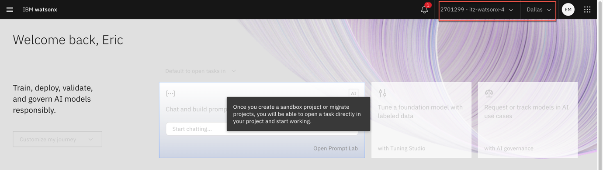

    2. Click on the hamburger menu in the upper left to expand it.

    3.  Locate the AI governance section of the menu, expanding it if necessary, and click on AI use cases.

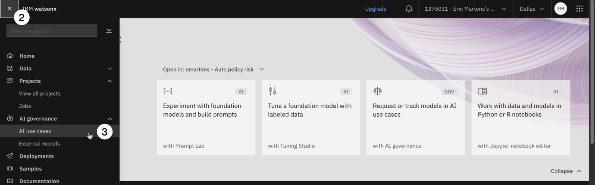

    4.  Click on the **Gear** icon to open the **Manage** menu for AI use cases.

> 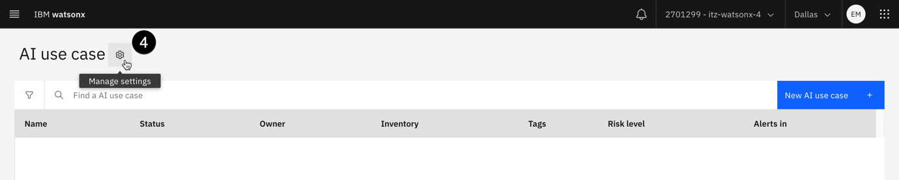

    5.  Click on the **Inventories** item from the menu on the left to see the full list of inventories.

    6.  Examine the list of inventories in the middle of the screen. If you see the following screen, you do not have access to a model inventory:

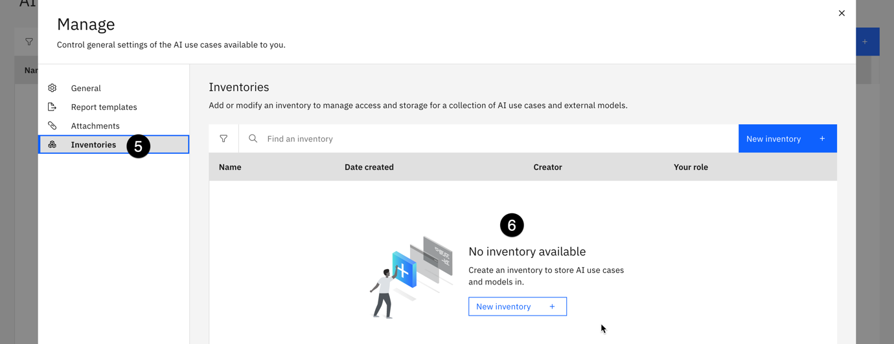

    7.  Click on **New inventory**.

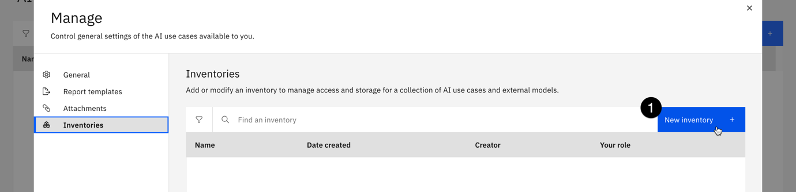

    8.  Give your inventory a name that includes some identifying information such as your email address and the purpose it will be used for. You may also give your inventory a description.

    9.  Use the **Object storage instance** dropdown to select your object storage service.

<!-- -->

    11. Click **Create** to create your inventory. Inventory creation can take up to a minute to complete.

> 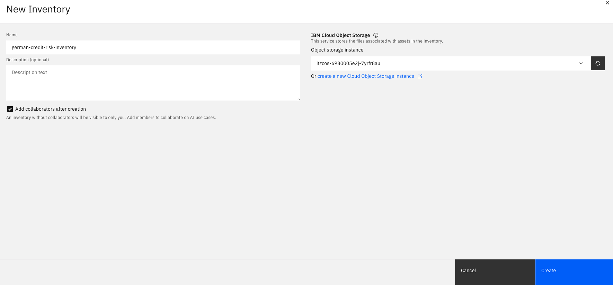

2.  **<u>Define Model Use Case</u>**

In this step, you will create a use case for the predictive risk model in the model inventory you identified (or created) in the previous step. In this case, we are using a financial risk dataset of some customers, and determine whether they are high risk or low risk. This is a classic case of binary classification.

As the first part of the process for approving the model, the stakeholders in the company would create a use case for the policy evaluation model to organize the different versions, data, and environments used to build and deploy the candidate models.

    1.  As done in the previous step, click on the hamburger option on left, and locate AI governance and click on AI use cases

    2.  Click the **New AI use case** button to open the **New AI use case** window.

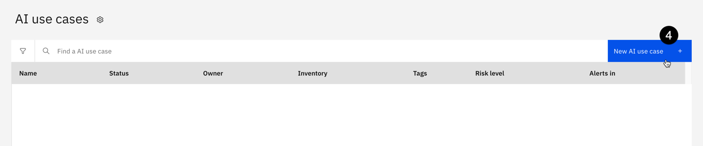

    3.  Give your use case a name. If you are using a shared account, use some identifying information to mark it as belonging to you.

    4.  Give your use case a description for the business issue it is attempting to solve.

    5.  Use the **Risk level** dropdown to set the associated level of risk. In a real-world example, this would be performed by the risk management officer of an organization.

    6.  Use the **Inventory** dropdown to select the model inventory you identified in a previous step.

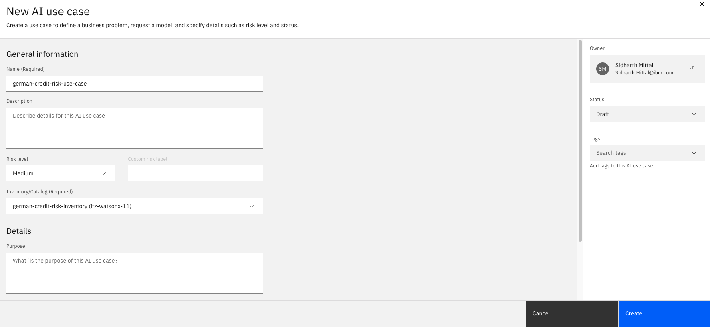

    7.  Click on the **Status** dropdown on the right side of the screen, and note the different values available.

    8.  Use the dropdown to set the **Status** to **Development in progress**.

    9.  Click **Create**. After a moment, the use case will be created.

    10. Take a moment to review the use case screen, and note the **Access** tab, which allows sharing of the use case with other stakeholders to allow collaboration on the model lifecycle.

You have successfully created a use case for an AI model to address a business need.

Now, we are ready to track the model that we create in lab 102.

3.  **<u>Model tracking</u>**

    1. Go to the project created in lab 101, and select the model, which was saved under assets in lab 102.

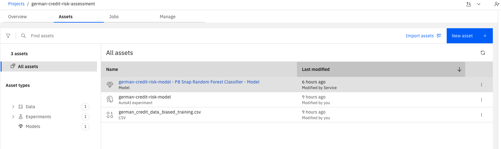

    2.  Click on the saved model, and on the new screen click Track AI use case under the Governance section.

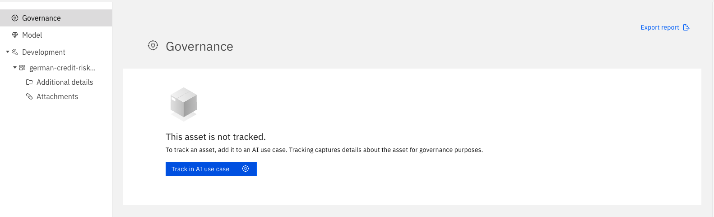

    3.  In the next screen, select the AI use case which you created in Step 2 of this lab, and click on Next.

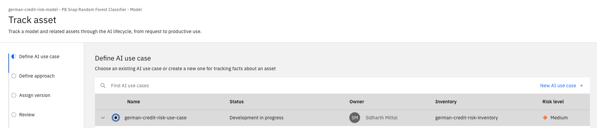

    4.  Under the approach section, leave Default approach selected and click next.

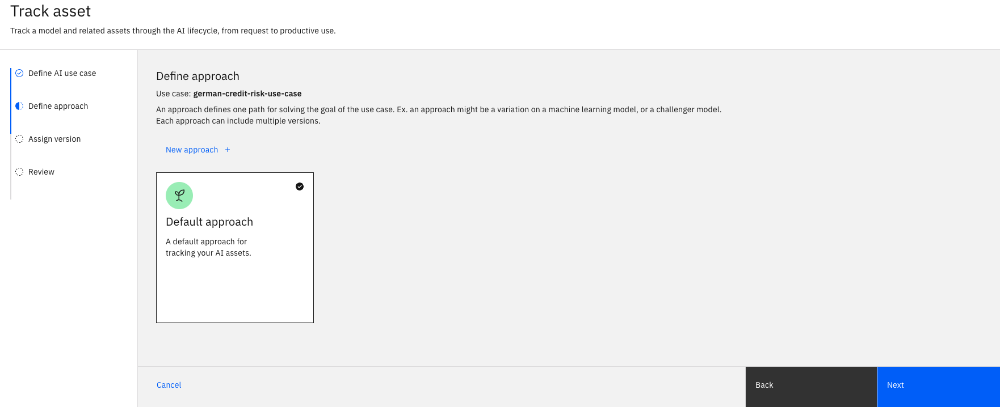

    5.  When asked to assign a model version, leave Experimental selected. For production-ready models, you can manually select the version number depending on the state of the mode. Click next and Track asset to start tracking the model.

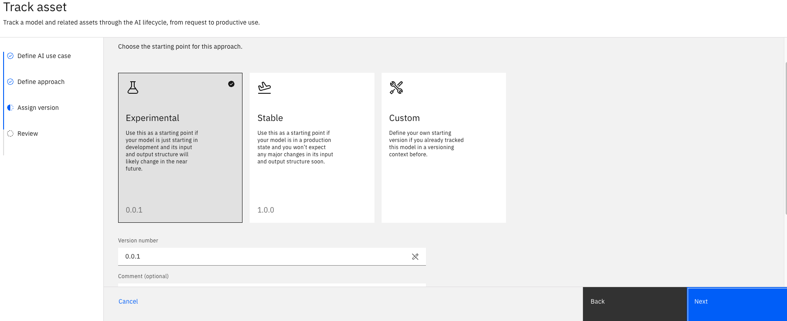

    6.  Once the model tracking has been enabled, you will be returned to the model information screen. You can now view the model information in the use case. Click the View details arrow icon button. A new tab will open in your browser showing the model use case in your model inventory.

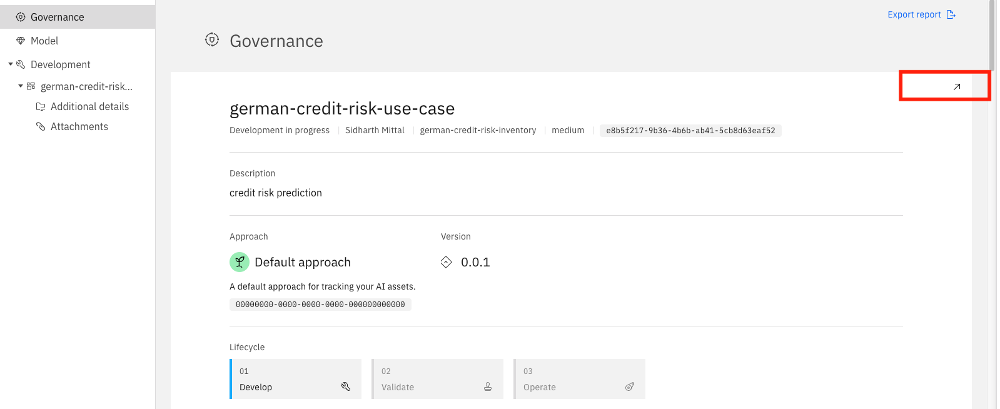

    7.  Click on the Lifecycle tab of the use case, and scroll down to the map of models contained in the Default approach section.

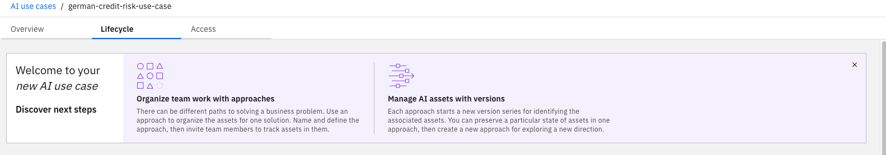

    8.  If you click on the model name from this screen, you will see the full model information that is also available from clicking on it from the project. The Lifecycle tab of the AI use case is useful for stakeholders and business users to get a quick overview of all the models attempting to address a particular issue, with the ability to drill down for more information as necessary, all without needing access to the project where the developers and data engineers are working.

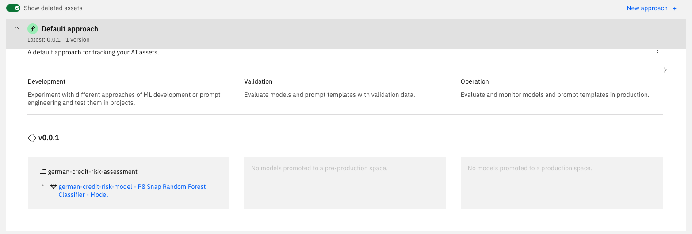

You have successfully enabled model tracking, and can now observe the changes as the model goes through the lifecycle.
