**<u>Lab 104</u>** (**<u>Model configuration for watsonx.governance</u>**)

For evaluating the model, we will use Openscale (watsonx.governance evaluation engine). To access this, go to resource list in your IBM cloud account.

1.  **<u>Access OpenScale</u>**

    1.  When inside your cloud account, click on the hamburger tile on top left, and select Resource List

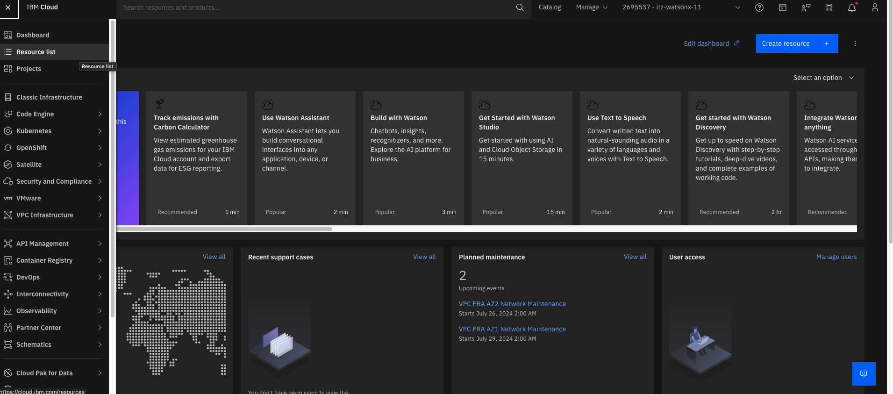

    2.  Under Resource list, click on the name section corresponding to the watsonx.governance product:

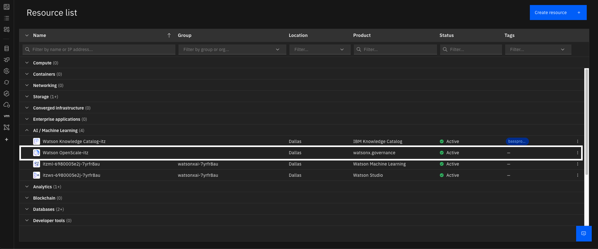

    3.  In the next screen, click on launch Watson OpenScale:

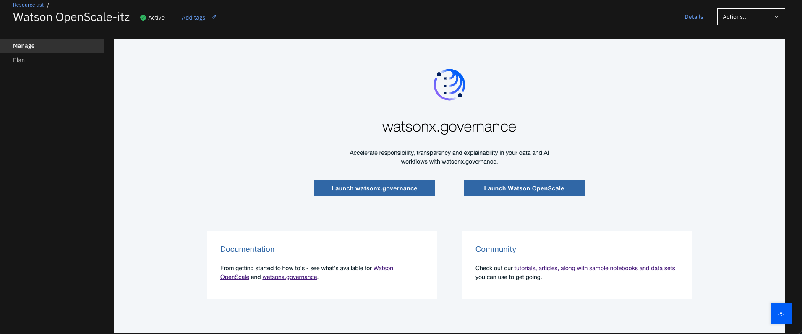

2.  **<u>Configure deployment space for monitoring</u>**

    1.  Click on the **Configure** button on the left menu bar.

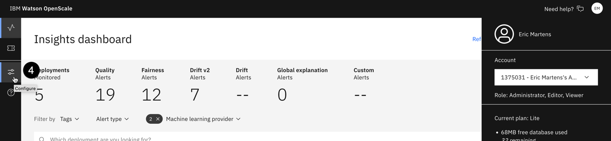

    2.  From the **Required** section, click on **Machine learning providers**.

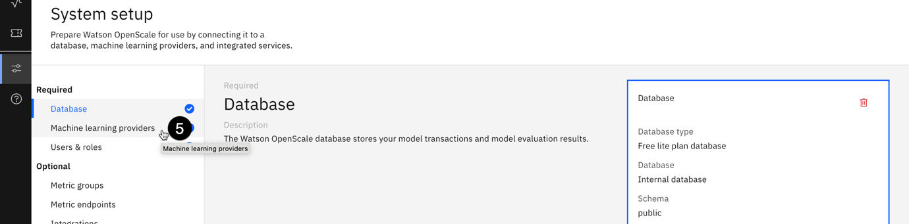

    3.  Click on the **Add machine learning provider** button.

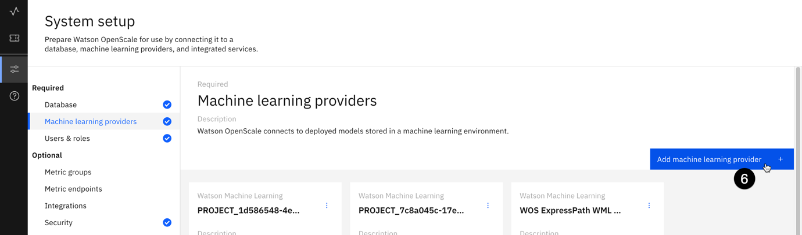

    4.  Click on the **pencil icon** to edit the name of the machine learning provider.

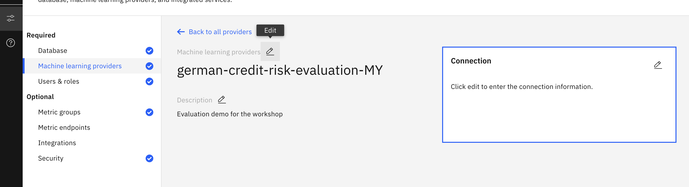

    5.  Click on the **pencil icon** in the **Connection** tile.

    6.  Click on the **Service provider** dropdown, then click on the **Watson Machine Learning (V2)** option.

    7.  Click on the **Deployment space** dropdown, then locate and click on the deployment space you created for this lab. Note that you are specifying the models in this space as **Pre-production** models.

    8.  Click on the **Save** button.

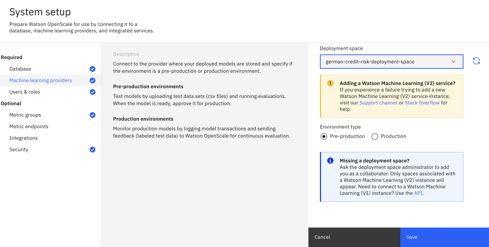

Your deployment space has now been identified as a machine learning provider for the monitoring service. You may now configure monitoring for the model itself.

3.  **<u>Add the model to the dashboard</u>**

    1.  Click on the monitor icon to return to the **Insights dashboard**.

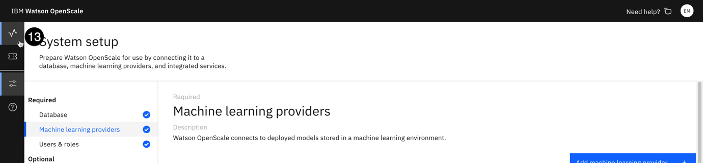

    2.  Click on the blue **Add to dashboard** button. The **Select a model deployment** screen will open.

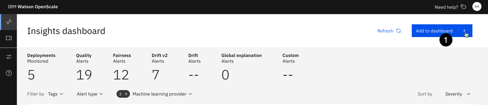

    3.  Click on the **Machine learning providers** button.

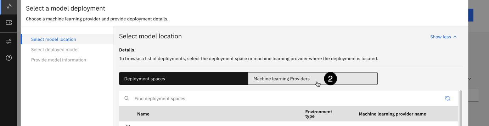

    4.  From the list of providers, select the one you are using for this lab.

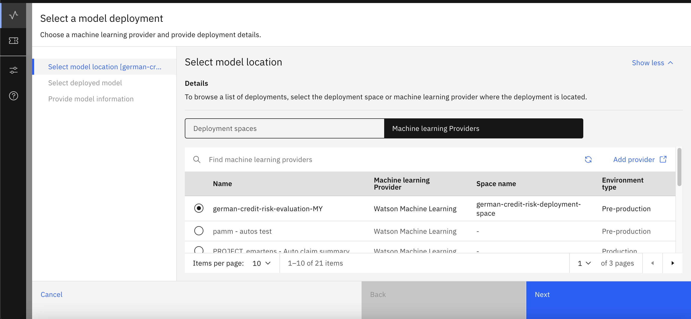

    5.  Click **Next**. The monitoring tool will retrieve the list of deployed models in this space. From the list of deployed models, select the one you are using for this lab. Click Next.

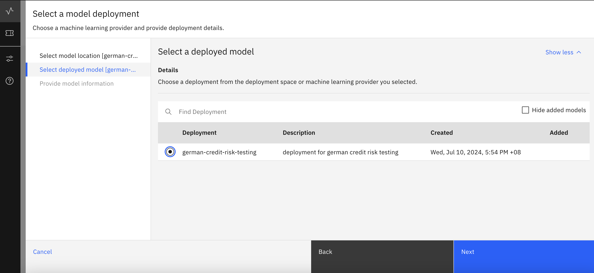

    6.  The information on the Provide model information screen will be retrieved from the available model metadata. Click the View summary button, then click Finish. After a brief wait, the metrics overview screen for the model will open.

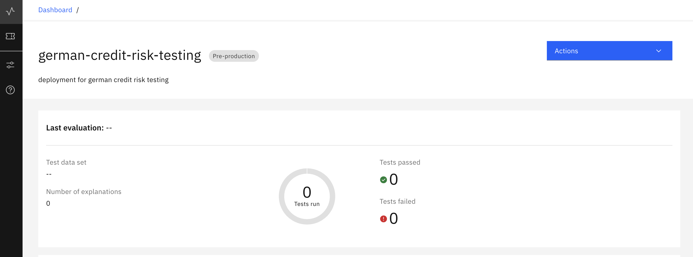

4.  **<u>Connect to the training data</u>**

Next, you will configure the individual monitors for the model. Note that each deployed model can have its own custom metrics and alert thresholds configured, allowing administrators, compliance officers, and risk management professionals to ensure that the models meet all relevant regulations and internal requirements.

    1.  Return to the monitoring Insights dashboard.

    2.  Click on the tile (german-credit-risk-testing) for the model you configured for monitoring in a previous step.

    3.  Click on the Actions button to open the Actions dropdown.

    4.  Click on configure monitors.

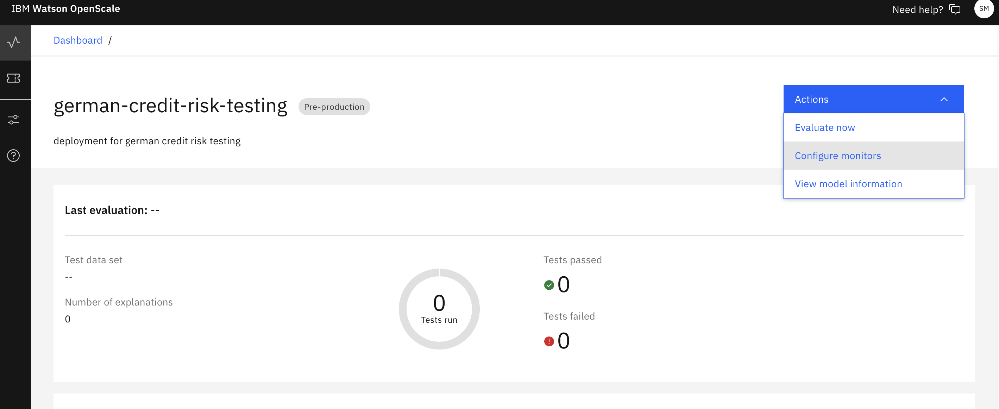

    5.  Click the edit icon in the training data tile.

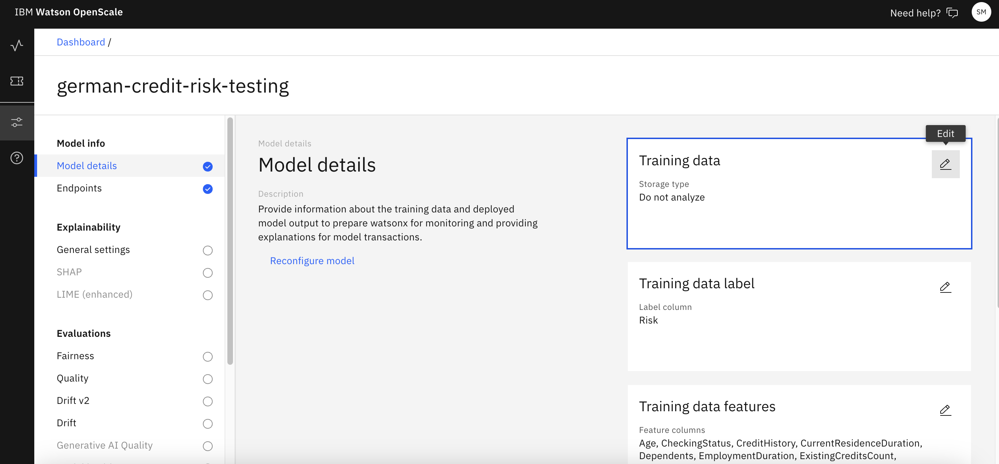

    6.  Leave the use manual setup option selected for Configuration method and click Next. The Specify training data screen opens.

    7.  Click on the training data option dropdown and click on upload file. Under the training data file option, upload the German credit data csv file, which was used in the training of model, and for delimiter select Comma. Click Next.

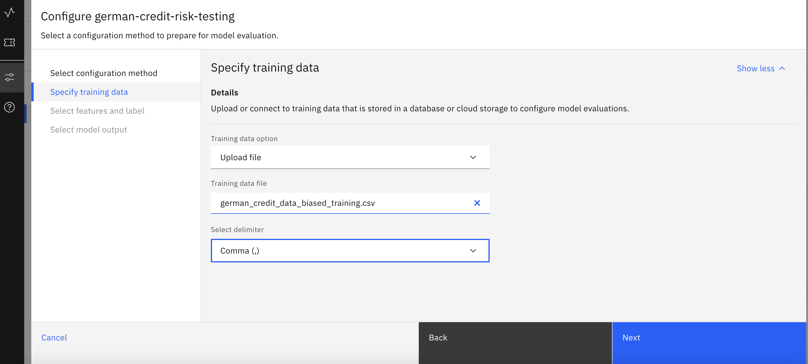

    8.  The monitoring tool should correctly identify the feature and label columns, using the metadata stored with the model. Click Next.

    9.  The monitoring tool also correctly identifies the prediction field. Click View summary to continue.

    10. Click Finish to save the training data setup.

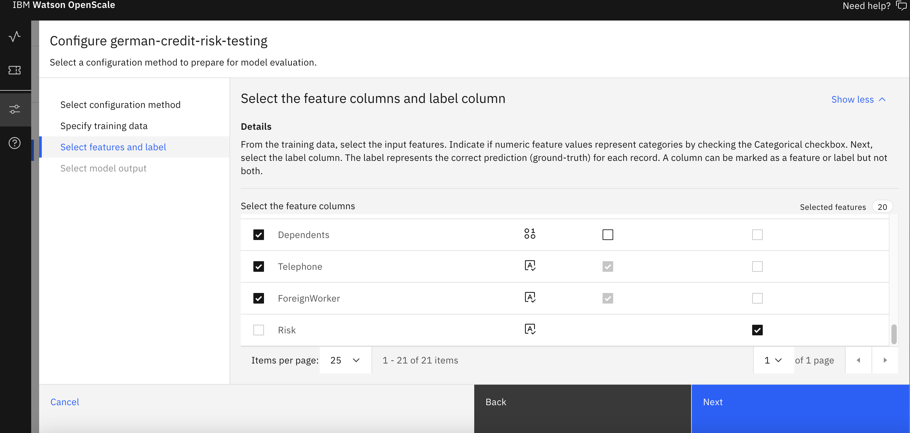

In this lab, we configured the models and uploaded the training data which will be used to calculate the evaluation metrics later. In the next lab, we will configure the evaluation monitors, and run an evaluation using test dataset.
