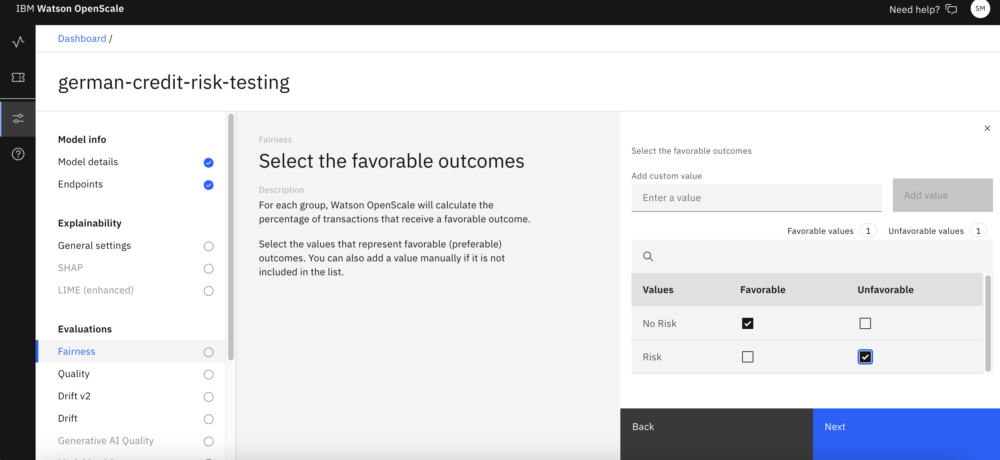
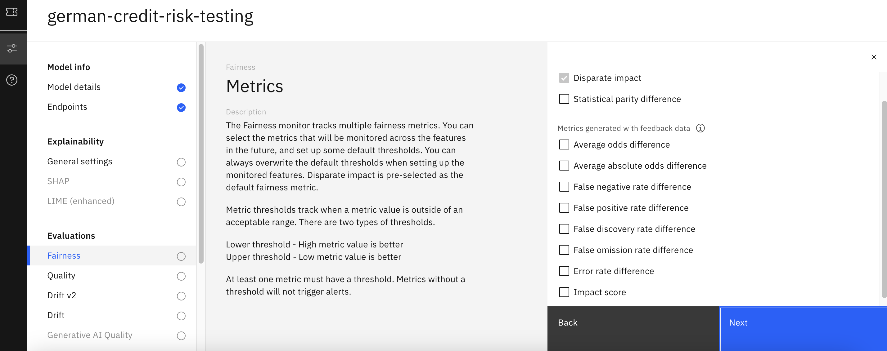
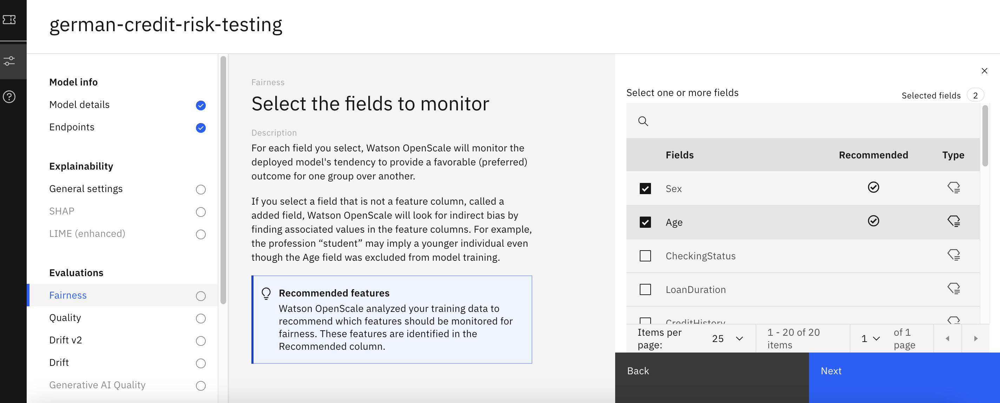
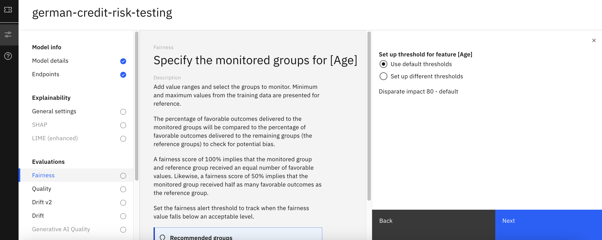
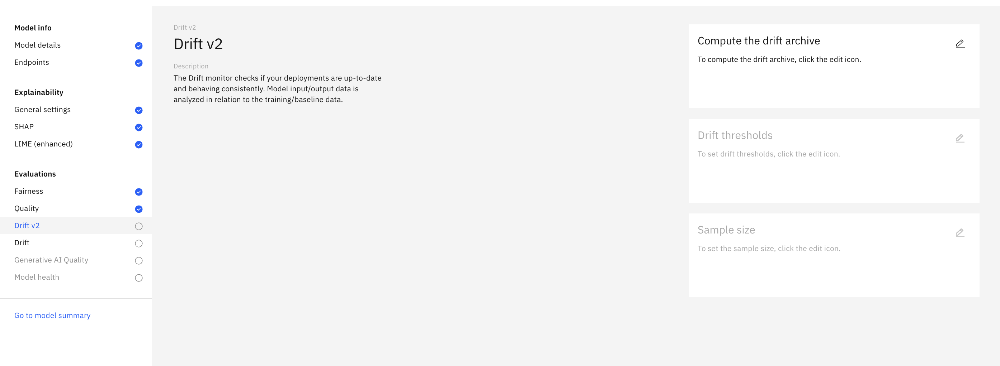
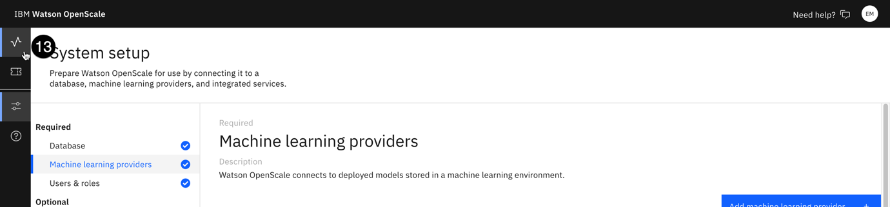
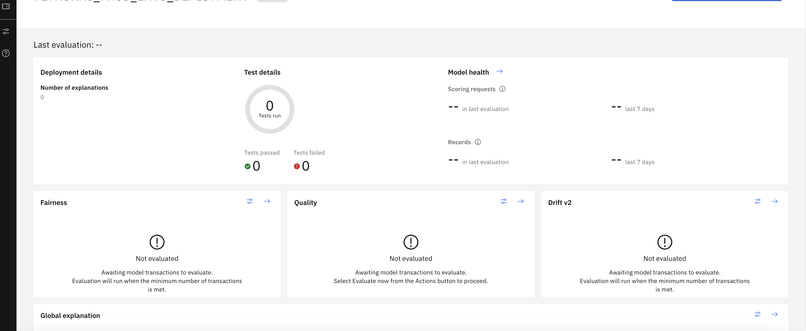

**<u>Lab 105</u>** (**<u>Run and interpret evaluation</u>**)

In the previous lab, we configured OpenScale. In this lab, we will configure various model evaluation monitors, and then run an evaluation to calculate these metrics.

1.  **<u>Configure fairness monitors</u>**

    1. From the list of Evaluations on the left, click on fairness.

    2.  Note the description of fairness in the centre of the screen, which gives a good definition of what the monitor is evaluating. Click on the edit icon in the configuration tile.

    3.  You will manually configure the fairness files. Leave configure manually selected and click Next to proceed. To properly monitor a model for unfair bias, you must specify which model outcomes are favourable and which are unfavourable. For our use, favourable class is No Risk and non-favourable class is Risk. Click Next.

    4.  Set the minimum sample size to 50 and click next.

> 

    5.  Leave the selected monitored metrics set to Disparate impact and click Next.

    6.  Leave the lower and upper thresholds for Disparate impact set to their defaults, and click Next.

    7.  In the next screen, select the fields that you need to monitor for fairness. For now, retain the default values suggested by OpenScale (after analyzing the training data). Click Next.

    8.  In the next screen, select the groups which are to be monitored against the reference group. Here, the percentage of favorable outcomes delivered to the monitored groups will be compared to the percentage of favorable outcomes delivered to the remaining groups (the reference groups) to check for potential bias.

    9.  Use the default alert threshold (80), and click Save to finish configuring the fairness monitor. It may take up to a minute for the configuration to save, at which point you will be returned to the model settings screen.

<!-- -->

2.  **<u>Configure the quality monitor</u>**

    1.  From the list of evaluations on the left, click on Quality.

    2.  Click the edit icon on the Quality thresholds tile.

> 

    3.  Click the Edit icon on the Quality thresholds tile.

    4.  Leave the default lower and upper threshold values as they are. You can click the Information icon to the right of each value for more information on how it is calculated. Click Next.

    5.  Set the Minimum sample size value to 50. Click Save to save the quality configuration.

<!-- -->

3.  **<u>Configure the explainability service</u>**

    1.  In the Explainability section, click on General settings, and in the explanation method tile, click on the Edit icon.

    2.  Two different methods are available for explanations: Shapley Additive Explanations (SHAP) or Local Interpretable Model-agnostic Explanations (LIME). Toggle the SHAP global explanation to ON, and for local explanation method select LIME.

    3.  Click Next, and for control features go ahead with the default selection (i.e., selected all).

4.  **<u>Configure SHAP</u>**

    1.  To configure SHAP, click the pen icon under common settings.

    2.  For background data select Use training data, and click Save.

5.  **<u>Configure Drift v2</u>**

    1.  Drift is important metric to monitor if the deployments are up-to-date. To configure drift, click on pen under compute the drift archieve.

    2.  For compute option, select Compute in Watson OpenScale.

    3.  For the drift thresholds, retain the default values. Click Next. For minimum sample size, keep 50 and click save.

6.  **<u>Run an evaluation</u>**

    1.  Return to the Insights Dashboard by clicking on the Dashboard link the upper left, and click on the tile for the model you configured (german-credit-risk-testing)

    2.  Click on the Actions button to open the Actions menu, click on Evaluate now.

    3.  Import test data screen pops up, select import from CSV file and then browse the feedback file from your local system, and keep the option of Test data includes output as unchecked.

    4.  Click Upload and evaluate.

After some time, the results of the evaluation can be seen in the dashboard.

7.  **<u>Viewing and interpreting the results</u>**

    1.  Take a moment to review the results of the evaluation. Note that, based on the content of the random sample of the evaluation data, your results will vary each time you perform the evaluation.

    2.  Review the different metrics in the quality table. In the screenshot below, notice that, if the measurement falls below the alert threshold set when you configured the quality monitor, the amount will be listed in the Violation column of the table.

> 

    3.  Beyond meeting standards for quality and fairness, AI models in many cases are required to provide explanations into the decisions or predictions they make. This can be viewed in watsonx.governance by clicking on the arrow icon in the fairness tile, and then selecting view payload transactions.

    4.  From the table of transactions, click one of the Explain prediction links. The explainability service will use the LIME algorithm to generate a detailed explanation, which can take a few minutes to run.

> 

    5.  Once the explanation has been generated, scroll down to the graph, which shows the influence different features had in the model's outcome. Features in blue increased the final score, while those in red decreased it. For classification models, blue features contributed positively to the model's confidence in the prediction, while those in red decreased the confidence.

> 

    6.  Click on the Inspect tab. On this tab, you can alter values associated with the record and re-submit it to the model to see how the final risk calculation changes. This can be useful for understanding how the model is working, or if a policyholder is looking for ways to decrease their risk assessment.

> 

8.  **<u>Approving model for production</u>**

    1.  Return to the Insights Dashboard by clicking on the Dashboard link the upper left, and click on the tile for the model you configured (german-credit-risk-testing)

    2.  Click on the Actions button to open the Actions menu, click on Approve for production now.

    3.  Now, before configuring the production monitoring in the OpenScale, we need to promote our model to a development space. For this, we will repeat step under Section 2 and 3 in Lab 102. Just make sure, while creating new deployment space, select Production as the stage, and rest of the steps remain the same.

    4.  Now, we will create a new machine learning service provider for the production space. Under machine learning providers, fill the name of providers and description, along with connection details. Select service provider as Watson machine learning (v2),

> 

    5.  Click on the monitor icon to return to the **Insights dashboard**.

    6.  Click on the blue **Add to dashboard** button. The **Select a model deployment** screen will open.

    7.  Click on the **Machine learning providers** button.

    8.  From the list of providers, select the one you are using for this lab (production level ml provider). Click next

> 

    9.  Select the deployed model. Click next.

    10. In the next provide model information screen, select import settings and click next. This is to import the configuration settings from the pre-production. Click Next.

    11. In the next screen, select the pre-production deployment, and click view summary and finish.

    12. OpenScale production dashboard will show-up with all the metrics that we configured for the pre-production.

    13. Now, we can monitor this production model.

    14. Now, we go back to our dashboard. Click actions, and select evaluate now.

    15. From your data folder, upload payload data, and click evaluate now.

After running, you can see results of your evaluations in the dashboard. If you go back to your watsonx.governance AI use case dashboard, you can see these alerts in the model lifecycle.

