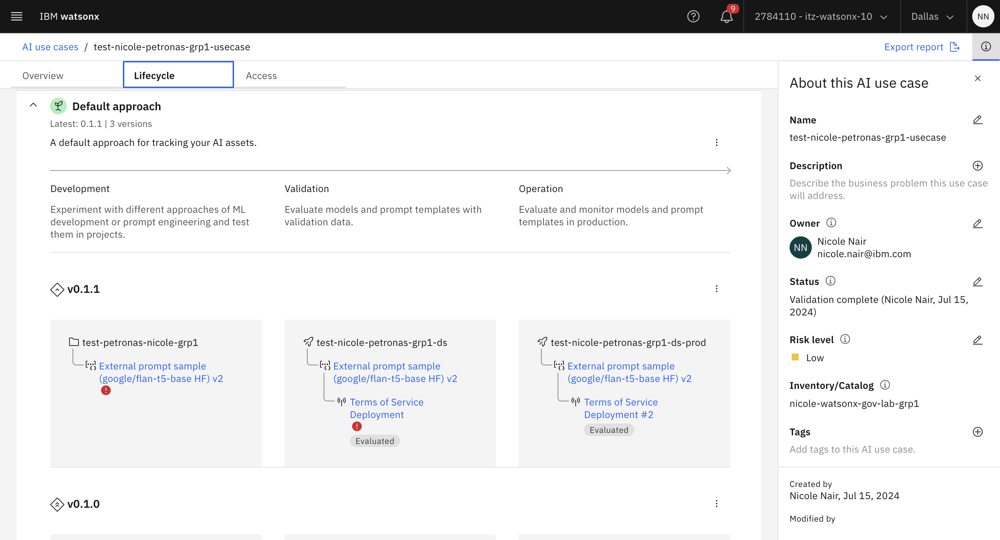

# Lab 205: Detached prompt monitoring

## Summary
In this lab, we will take you through a Jupyter notebook that shows how to evaluate third-party prompts and models. In particular, we will be evaluating a model hosted on huggingface.

We also assume that you run the notebook from within a Watson Studio instance in IBM Cloud. You can also run this standalone, for example, on your laptop, but need to make sure you install the appropriate Python libraries, which may or may not be supported on the hardware you are running on. When using an IBM Cloud based Python runtime, all the required libraries are preinstalled.

## Set up the notebook
To run the notebook in IBM Cloud, you have to import it. The notebook for file for import is [here](./Detached%20Prompt%20Evaluation%20with%20WatsonXGov.ipynb). 

In your project's Asset view, click on "New asset" and select "Work with data and models in Python or R notebooks." 

In the next dialog, select the notebook file for upload and give it a name of your choosing. You can use the default runtime configuration. It will have the appropriate libraries pre-installed.

Once you have initiated the runtime and see the notebook loaded, you can step through it. Please study the code, and feel free to experiment and make changes as you see fit. Enjoy!

# Seeing your detached prompt within the UI

After running the notebook, the detached prompt will be registered as an asset in the project whose project ID you specified. Therefore, when you navigate to your watsonx.ai project, you will be able to view the prompt.

How your detached prompt should appear within the project:

If you click into the prompt, you will be presented with 2 tabs: AI Factsheet and Evaluate. 

In AI Factsheet you can view various pieces of information about your 3rd party model. For example, the model id, the prompt template, as well as any results for tests that you have run. Scroll through the different model facts captured.

In Evaluate tab, you can run an evaluation. Click "Evaluate".

Fill in the required information, and upload the file from data/summarisation.csv.

You will be able to view the detailed results in the Evaluate tab.

# Tracking your detached prompt within an AI Use Case

Just like regular prompts, detached prompts can also be tracked within AI Use Cases.

To do this, click on the three dots next to your detached prompt asset within the project, then click "Track in AI Use Case". Proceed using the same steps described in lab 203, but create a new AI use case entitled Terms of Service Summarization, and track within this new use case.

Once you are done, you will be able to view all the details of the prompt/model within the AI Use Case, as well as manage its lifecycle there.

# Evaluating your detached deployment & managing its lifecycle

Similar to regular prompts (see lab 203), you can promote your detached prompt to a space and "deploy" it. Note that drift is not currently supported for detached deployments.

Once it is deployed, activate monitoring, and then you can evaluate your deployed prompt. Sample feedback and payload data are provided at data/summarisation_deploy_feedback.csv and data/summarization_deploy_payload.csv, which you can use to run the evaluations, using the same steps as described in lab 203.

As shown in the image below, you can managed the detached prompt's lifecycle within the use case, track its metrics, versioning there etc. Therefore, watsonx.governance's AI Use Case is able to manage and govern 3rd party models and watsonx.ai models within the same framework and tool. This is incredibly useful especially if you are including models hosted on different platforms within the same AI use case.

