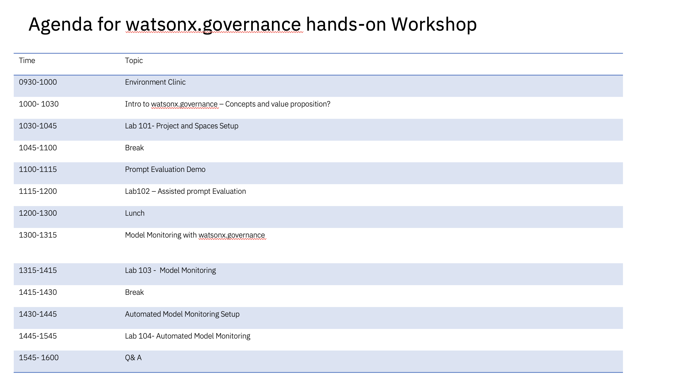
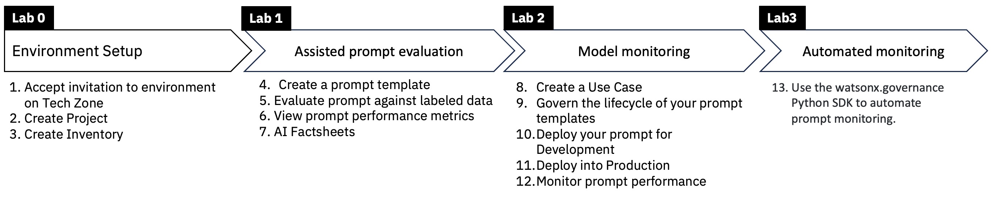
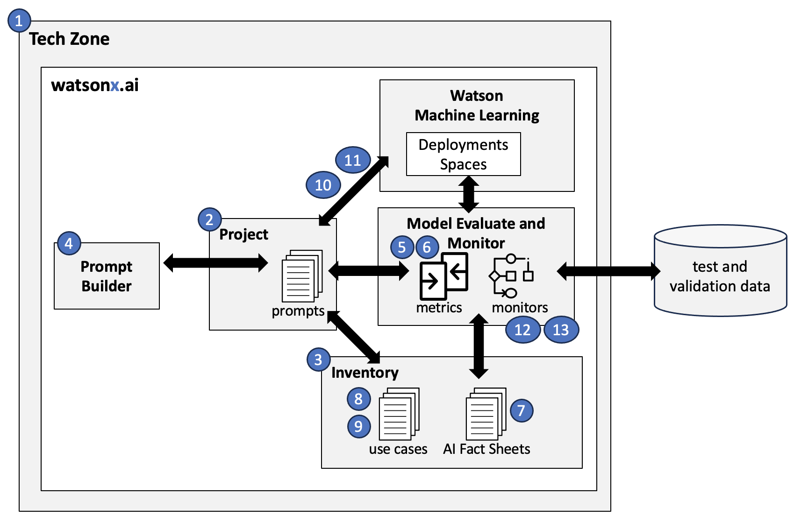

# watsonx.governance workshop: insurance claims use case

  

   

  

   

This repo contains material and lab instructions for a Workshop teaching the foundations of watsonx.governance. You will complete multiple labs during this workshop where each lab builds off the prior.  The high-level overview below shows what you will accomplish during this workshop.

You will complete various tasks in the governed AI lifecycle of an **Insurance Claims use case** where you will create an AI system to summarize insurance claims, focusing on the vehicles involved and the damage that occurs. You will perform tasks required by various personae across the AI development and governance teams.

  

## Workshop Architecture - Simplified
The diagram below highlights the numerous technologies and skills that you will work with during the labs.  Numbering matches the workflow described above.

  

