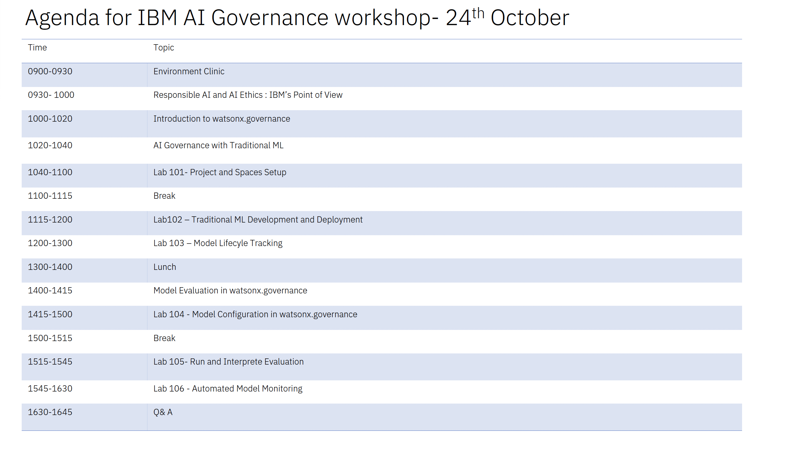

# IBM AI Governance Workshop

  

   

  

   
   

  

   

This repo contains material and lab instructions for a Workshop teaching the foundations of watsonx.governance. You will complete multiple labs during this workshop where each lab builds off the prior.  The high-level overview below shows what you will accomplish during this workshop.

On Day 1, you will complete various tasks in the governed **predictive** AI lifecycle of an **Credit Risk use case** where you will create an AI system to build an AutoML model for classifying credit risk. You will perform tasks required by various personae across the AI development and governance teams.

On Day 2, you will complete various tasks in the governed **generative** AI lifecycle of an **Insurance Claims use case** where you will create an AI system to summarize insurance claims, focusing on the vehicles involved and the damage that occurs. You will perform tasks required by various personae across the AI development and governance teams.
