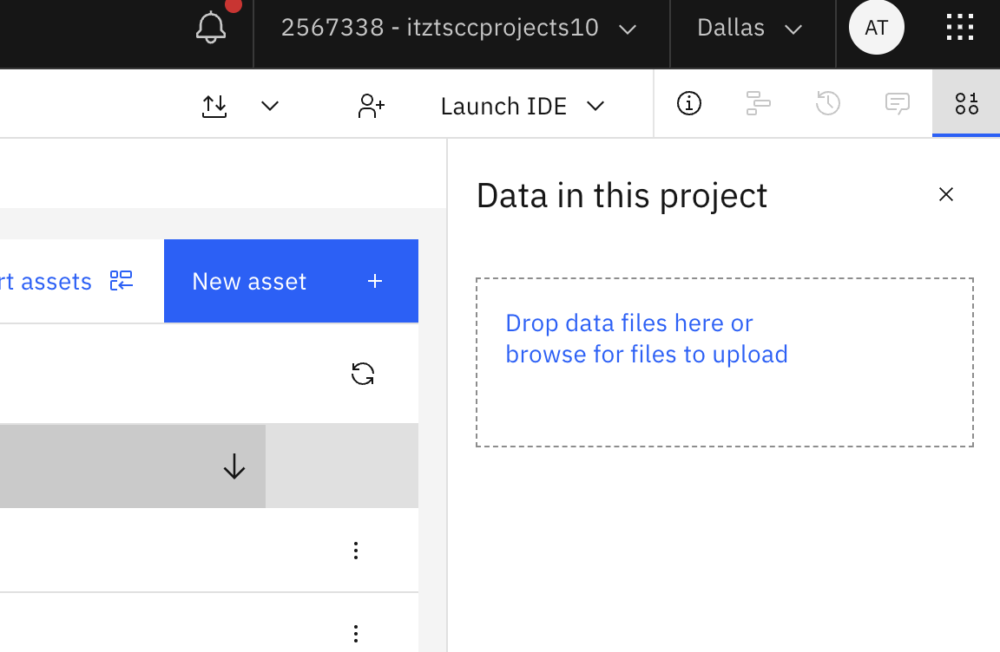
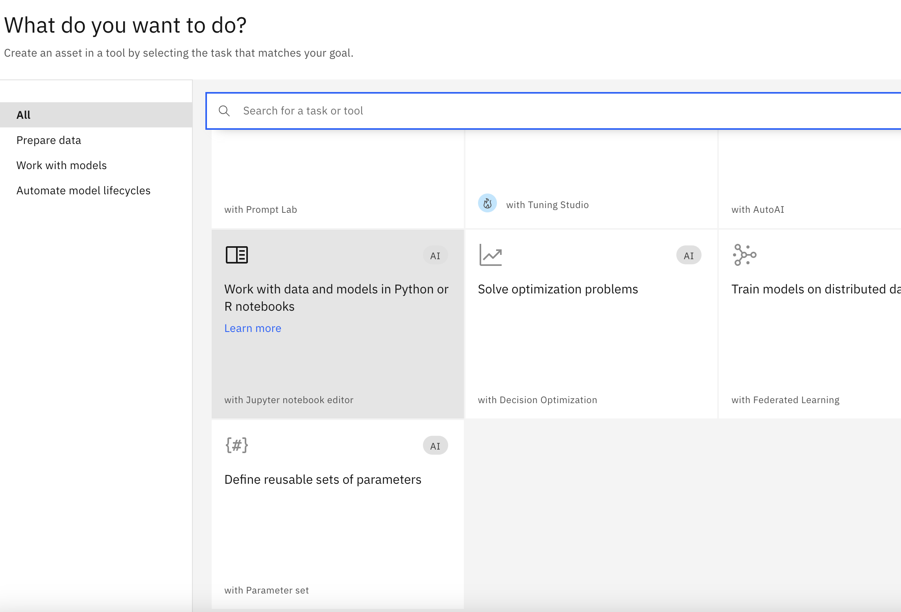
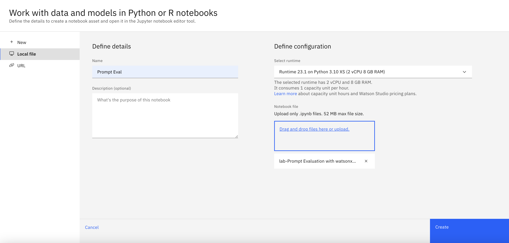

# Lab 3: Automated eval notebook

## Summary
In this lab, we will take you through a Jupyter notebook that shows how to automate the use of watsonx.governance with its Python SDK. 

We also assume that you run the notebook from within a Watson Studio instance in IBM Cloud. You can also run this standalone, for example, on your laptop, but need to make sure you install the appropriate Python libraries, which may or may not be supported on the hardware you are running on. When using an IBM Cloud based Python runtime, all the required libraries are preinstalled.

<div align="center">
  
</div>

## Set up the notebook
Before you can run the notebook, you have to add a CSV file with payload data into the project you have been using for previous labs. We will reuse this project here. 

In your project's Assets view, go to the "Data in this project" section and upload the [summarization.csv](data/summarization.csv) file.

<div align="center">
  
</div>

To run the notebook in IBM Cloud, you have to import it, too. The notebook for file for import is [here](./Prompt%20Evaluation%20with%20watsonxgov.ipynb). 

In your project's Asset view, click on "New asset" and select "Work with data and models in Python or R notebooks." 



In the next dialog, select the notebook file for upload and give it a name of your choosing. You can use the default runtime configuration. It will have the appropriate libraries pre-installed.



Once you have initiated the runtime and see the notebook loaded, you can step through it. Please study the code, and feel free to experiment and make changes as you see fit. Enjoy!

## Note for users completing this lab outside of class

If you are completing this lab outside of an in-person class, you may need to create a new deployment space rather than use an existing one as laid out in the notebook for the lab. To do this, complete the following steps just BEFORE "Setting up the space" and INSTEAD of "Below details are required if user choose to use an existing space". All of the code inside of code blocks below is what you will want to include in your jupyter notebook, and to make a new cell simply select `Cell` --> `Cell Type` --> `Code`:

```
space_name = "" # YOUR_SPACE_NAME
```

Tip: Your `WML_INSTANCE_NAME` and `WML_CRN` can be read from the [Cloud console resources page](https://cloud.ibm.com/resources). From that page, expand the `AI / Machine Learning` section and copy the name of your WML instance listed there. Select the row corresponding to your WML instance, and copy the CRN displayed in the popup on the right side of the page

Paste your WML_INSTANCE_NAME, WML CRN in the following fields and then run this code.

```
WML_INSTANCE_NAME =  "" # YOUR_WML_INSTANCE_NAME
WML_CRN =  "" # YOUR_WML_CRN
```

In next cell, you will need to paste COS_RESOURCE_CRN. A Cloud Object Storage instance is used to store all of the data and metadata related to your project.
To find it, expand the `Storage` section of the resources page and select the COS instance you have been using for previous labs. Click on its name, and select the `Details` link, which shows the CRN.

```
COS_RESOURCE_CRN = ""
```

---

<div align="center">
  
</div>
