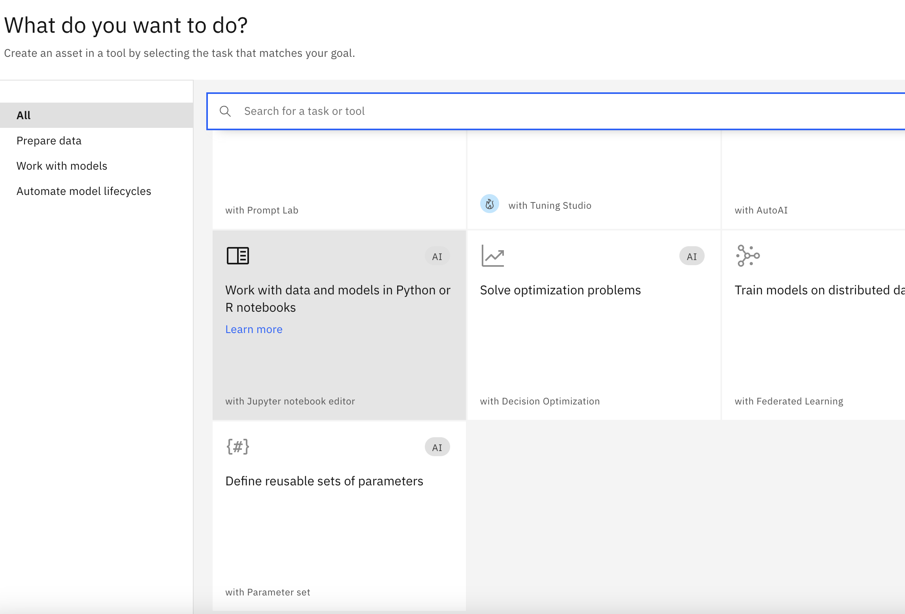
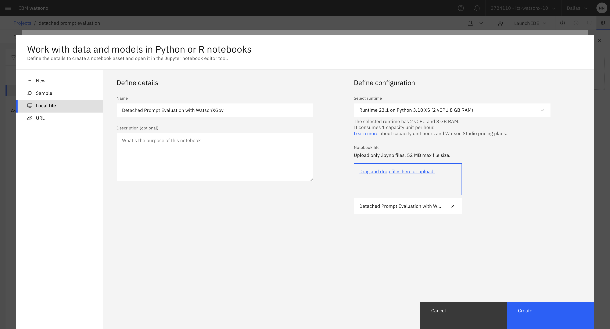

# Lab 205: Automated eval notebook

## Summary
In this lab, we will take you through a Jupyter notebook that shows how to evaluate third-party prompts and models. In particular, we will be evaluating a model hosted on huggingface.

We also assume that you run the notebook from within a Watson Studio instance in IBM Cloud. You can also run this standalone, for example, on your laptop, but need to make sure you install the appropriate Python libraries, which may or may not be supported on the hardware you are running on. When using an IBM Cloud based Python runtime, all the required libraries are preinstalled.

## Set up the notebook
To run the notebook in IBM Cloud, you have to import it. The notebook for file for import is [here](./Detached%20Prompt%20Evaluation%20with%20WatsonXGov.ipynb). 

In your project's Asset view, click on "New asset" and select "Work with data and models in Python or R notebooks." 

In the next dialog, select the notebook file for upload and give it a name of your choosing. You can use the default runtime configuration. It will have the appropriate libraries pre-installed.

Once you have initiated the runtime and see the notebook loaded, you can step through it. Please study the code, and feel free to experiment and make changes as you see fit. Enjoy!
